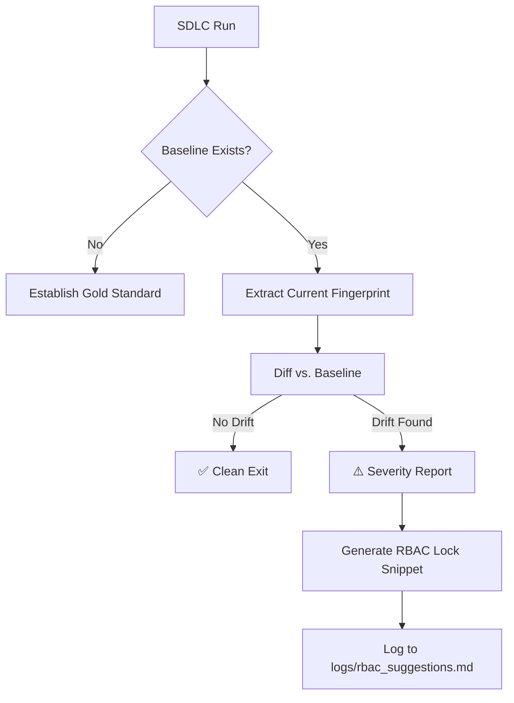

# 🤖 ASD Framework Orchestrator
**The Sovereign SDLC Execution Kernel**

The ASD Orchestrator is a 100% local, 8-agent Software Development Life Cycle (SDLC) engine designed to move AI coding from "unreliable magic" to "deterministic engineering."

---

## 🚩 The Problems We Solve

Most agentic frameworks fail in production because they suffer from four critical flaws that the ASD Orchestrator is built to eliminate:

1.  **The "Black Box" Problem:** You don't know *why* an agent made a decision. 
    *   *Our Solution:* **The Control Plane.** Every thought, context, and tool choice is recorded in `logs/control_plane.md`.
2.  **The "Hallucination-to-Disk" Problem:** Agents write buggy or insecure code directly to your workspace. 
    *   *Our Solution:* **Hard Quality Gates.** Automated Gatekeeper AIs (Architecture, QA, Security) must PASS the code before it is finalized.
3.  **The "Mega-Prompt" Fragility:** Large prompts are brittle and lose focus. 
    *   *Our Solution:* **8-Agent Waterfall.** We fracture the SDLC into 8 isolated personas (Requirements -> Arch -> Backend -> Frontend -> Infra -> QA -> Security -> Deploy).
4.  **The "Architectural Drift" Problem:** As you iterate, the AI silently switches your database or framework. 
    *   *Our Solution:* **The Memory Layer.** We extract a "Decision Fingerprint" and diff it against your project baseline on every run.

---

## 🏗️ The Building Blocks

The framework is composed of four autonomous layers working in concert:

### 1. The Execution Layer (The 8 Agents)
The project is passed like a baton through 8 specialized agents. No agent sees the whole project; they only see what is relevant to their phase, ensuring high-density focus and better code quality.

### 2. The Observation Layer (Control Plane)
Sits between the agent's brain and your disk. It records:
*   **Context Snapshots:** Exactly what was in the prompt.
*   **Decision Traces:** The raw reasoning chain.
*   **Intent-Execution Diffs:** What the agent planned vs. what it actually wrote.

### 3. The Governance Layer (Memory & Drift Detection)
The **Memory Layer** ensures long-term project integrity.
*   **Baseline:** The first run establishes the "Gold Standard" for your tech stack.
*   **Drift Detection:** If a later run tries to switch from FastAPI to Flask, or PostgreSQL to MongoDB, the system flags it as a **BREAKING** change.
*   **RBAC Locks:** Automatically suggests "Cognitive Locks" to freeze your architecture.

### 4. The Configuration Layer (Cognitive RBAC)
Managed via `config/`, this layer governs **Identity** (Personas), **Capability** (Tool access), and **Alignment** (Global rules).

---

## 🔄 Memory Layer User Flow



---

## 🚀 Quickstart Guide

### 1. Set Up the Brain
The orchestrator expects a local OpenAI-compatible API (LMStudio or Ollama).
*   **LMStudio:** Start server on `http://127.0.0.1:1234/v1` with `qwen2.5-coder-7b`.

### 2. Installation
```bash
git clone https://github.com/kasampra/asd-framework-orchestrator.git
cd asd-framework-orchestrator
pip install -r requirements.txt
```

### 3. Build & Govern
Execute the orchestrator. The `--project` flag is critical for the Memory Layer to track your specific baseline.

```bash
# Run 1: Establishes the Baseline
python src/orchestrator.py "Build a FastAPI app with SQLite" --project "my-app"

# Run 2: Automatically checks for Drift
python src/orchestrator.py "Update the app with a new login endpoint" --project "my-app"
```

---

## 📂 Artifacts & Traceability

| File | Purpose |
| :--- | :--- |
| `logs/audit.md` | High-level audit trail of every major decision and drift event. |
| `logs/control_plane.md` | Deep-dive telemetry for debugging agent reasoning. |
| `logs/rbac_suggestions.md` | Automatically generated locks to prevent architectural drift. |
| `.asd/fingerprints/` | JSON storage for project decision baselines. |

---

## License
MIT — Part of the [OwnYourIntelligence Series](https://www.linkedin.com/build-relation/newsletter-follow?entityUrn=7410977532142874624). Sovereign AI for sovereign engineers.
