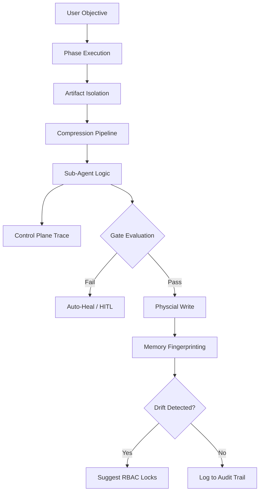

# 🤖 ASD Framework Orchestrator
**The Sovereign SDLC Execution Kernel**

The ASD Orchestrator is a 100% local, 8-agent Software Development Life Cycle (SDLC) engine designed to transform agentic coding from unreliable magic into deterministic engineering.

---

## 🚩 The Problems We Solve

Production-grade agentic frameworks must overcome several critical flaws. The ASD Orchestrator is engineered specifically to eliminate:

1.  **The "Black Box" Problem**: Inscrutable reasoning in hidden logs.
    -   *Solution*: **The Control Plane**. Telemetry captures every thought, context, and tool choice in `logs/control_plane.md`.
2.  **The "Hallucination-to-Disk" Problem**: Agents writing broken or insecure code directly to your workspace.
    -   *Solution*: **Hard Quality Gates**. Gatekeeper AIs (Architecture, QA, Security) must PASS the proposal before physical disk write.
3.  **The "Mega-Prompt" Fragility**: Massive prompts lose focus and blow out context windows.
    -   *Solution*: **8-Agent Waterfall**. Fractured SDLC into 8 isolated personas (Requirements -> Arch -> Backend -> Frontend -> Infra -> QA -> Security -> Deploy).
4.  **The "Architectural Drift" Problem**: Silent framework switches as iterations progress (e.g., swapping FastAPI for Flask).
    -   *Solution*: **The Memory Layer**. Extracts a "Decision Fingerprint" to detect and flag drift against your project baseline.
5.  **The "Context Pollution" Problem**: Large prompts accumulate useless "thinking" traces and irrelevant history.
    -   *Solution*: **Artifact Context Isolation**. The `ArtifactManager` only passes verified markdown artifacts down the baton chain.
6.  **The "Context Window Overflow" Problem**: Large codebases crash local models.
    -   *Solution*: **Three-Tier Compression**. The `ContextCompressor` applies Micro, Auto, or Full (LLM-based) compression to fit models (e.g., Qwen's 8k context).

---

## 🏗️ The Building Blocks

The framework consists of four autonomous layers working in concert:

### 1. The Execution Layer (The 8 Agents)
The project baton passes through 8 specialized agents. Isolated context ensures high-density focus and superior code quality. Agents can physically execute tools, such as the QA agent running `pytest` to verify its test suite.

### 2. The Observation Layer (Control Plane & Hooks)
Sits between the agent brain and the filesystem. Captures **Decision Traces**, **Context Snapshots**, and **Intent-Execution Diffs**. Use **HookManager** to trigger deterministic lifecycle events for logging and auditing outside the LLM's prompt.

### 3. The Governance Layer (Memory & Drift Detection)
The **Memory Layer** ensures long-term project integrity. The first run establishes a "Gold Standard" baseline. Subsequent runs are diffed for **Framework**, **Infrastructure**, or **Economic** drift, suggesting **Cognitive RBAC Locks** to freeze constraints.

### 4. The Configuration Layer (Cognitive RBAC)
Managed via `config/`, governing **Identity** (Personas), **Capability** (Tool access), and **Alignment** (Global SDLC rules).

---

## 🔄 Lifecycle User Flow



---

## 🚀 Quickstart Guide

### 1. Set Up the Brain
Ensure an OpenAI-compatible API is running (e.g., LMStudio or Ollama) with `qwen2.5-coder-7b`.

### 2. Installation
```bash
git clone https://github.com/kasampra/asd-framework-orchestrator.git
cd asd-framework-orchestrator
pip install -r requirements.txt
```

### 3. Build & Govern
Execute the orchestrator. Use the `--project` flag for memory tracking.

```bash
# First run establishes baseline
python src/orchestrator.py "Build a simple calculator web app" --project "calc-app"

# Subsequent runs verify integrity
python src/orchestrator.py "Add a history feature" --project "calc-app"
```

---

## 📂 Artifacts & Traceability

| File | Purpose |
| :--- | :--- |
| `logs/audit.md` | High-level audit trail of decisions, gate results, and drift events. |
| `logs/control_plane.md` | Detailed step-by-step telemetry, including compression tiers. |
| `logs/rbac_suggestions.md` | Cognitive Locks suggested to prevent architectural drift. |
| `.asd/fingerprints/` | JSON storage for project decision baselines. |

---

## License
MIT — Sovereign AI for sovereign engineers.
