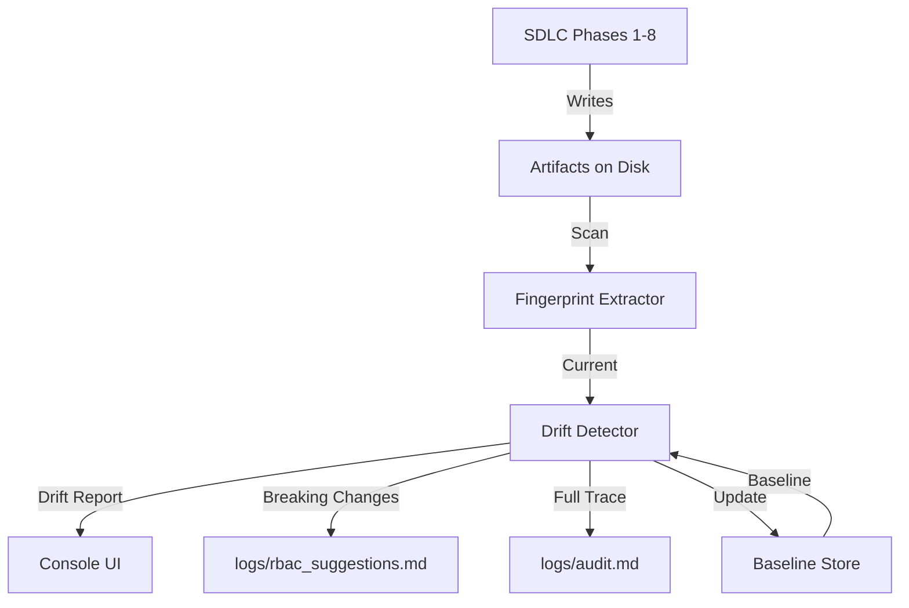

# 🧠 Memory Layer: Decision Fingerprinting & Drift Detection

The Memory Layer is a governance and consistency system for the ASD Orchestrator. It ensures that as the AI iterates through multiple SDLC runs, it does not silently drift from core architectural, infrastructure, or quality decisions.

---

## 🏗️ Architecture Overview

The Memory Layer operates as a **post-execution governance gate**. It uses the files on disk (Ground Truth) as the source of its fingerprint, ensuring that what was actually written is what gets measured.



### Core Components

| Component | Responsibility |
| :--- | :--- |
| **Fingerprint Extractor** | Scans `requirements.txt`, `Dockerfile`, `architecture.md`, and `logs/cost_report.json` to identify 17 core decision points. |
| **Cost Tracker** | Accumulates token spend and duration per phase during the SDLC run. |
| **Baseline Store** | Manages `.asd/fingerprints/baseline.json`. Persists the initial run as the "gold standard" and maintains a history of the last 50 runs. |
| **Drift Detector** | Compares current vs. baseline. Categorizes changes into `BREAKING`, `WARNING`, and `INFO` severities. |
| **RBAC Generator** | Creates "Cognitive RBAC Locks" — JSON snippets to be pasted into agent configurations to "lock" decisions and budgets. |

---

## ⚡ User Flows

### 1. The First Run (Establishing the Baseline)
When a project is run for the first time:
1. Orchestrator completes all 8 phases.
2. Memory Layer activates.
3. No baseline is found in `.asd/fingerprints/`.
4. **Action:** The current fingerprint is saved as `baseline.json`.
5. **Console Output:** `✨ Baseline established in .asd/fingerprints/`

### 2. Subsequent Runs (Verification)
On every run after the first:
1. Orchestrator completes execution.
2. Memory Layer extracts the current fingerprint.
3. **Action:** Compares current decisions against `baseline.json`.
4. **If No Drift:** Console prints `✅ No drift — baseline confirmed`.
5. **If Drift Detected:**
    - Displays a detailed report of changes.
    - Appends a trace to `logs/audit.md` with a `[MEMORY]` prefix.
    - If `BREAKING` drift occurs (e.g., changed Database or Web Framework), a suggestion is added to `logs/rbac_suggestions.md`.

---

## 📊 Decision Matrix (Severity Map)

The system monitors 17 specific fields across four domains:

| Field | Domain | Severity | Impact |
| :--- | :--- | :--- | :--- |
| `web_framework` | Architecture | **BREAKING** | Changes logic flow and dependencies. |
| `database` | Architecture | **BREAKING** | Requires schema migration and driver changes. |
| `auth_pattern` | Architecture | **BREAKING** | Critical security risk if changed silently. |
| `base_image` | Infrastructure | **BREAKING** | Changes OS dependencies and security surface. |
| `token_budget_exceeded`| Economics | **BREAKING** | Hard limit hit; pipeline should be locked. |
| `total_cost_usd` | Economics | **WARNING** | >30% increase in run cost vs. baseline. |
| `total_tokens` | Economics | **WARNING** | >30% increase in token volume vs. baseline. |
| `folder_structure` | Architecture | **WARNING** | Affects code organization (e.g., `src` vs `flat`). |
| `test_runner` | Quality | **WARNING** | Changes how CI/CD validates code. |
| `linter` | Quality | **INFO** | Minor stylistic change. |
| `most_expensive_phase` | Economics | **INFO** | Identifies which agent is consuming the most. |

---

## 🔒 Cognitive RBAC Locks

When a `BREAKING` drift is detected, the system generates a "Lock" block. This is intended to be used in the `config/agents.md` or `config/instructions.md` to strictly enforce the original decision in future prompts:

**Example Lock Snippet:**
```json
{
  "web_framework": "fastapi",
  "database": "postgresql",
  "base_image": "python:3.11-slim"
}
```

---

## 🛡️ Resilience & Safety

- **Non-Blocking:** The Memory Layer is wrapped in global error handling. If fingerprint extraction fails (e.g., due to file permissions), the pipeline completes normally, and the error is logged to the audit trail.
- **Ground Truth:** The system ignores LLM "reasoning" or "thinking" blocks. It only extracts data from physical files that will actually be deployed.
- **Project Isolation:** Use the `--project <name>` flag to maintain separate baselines for different projects within the same orchestrator instance.
